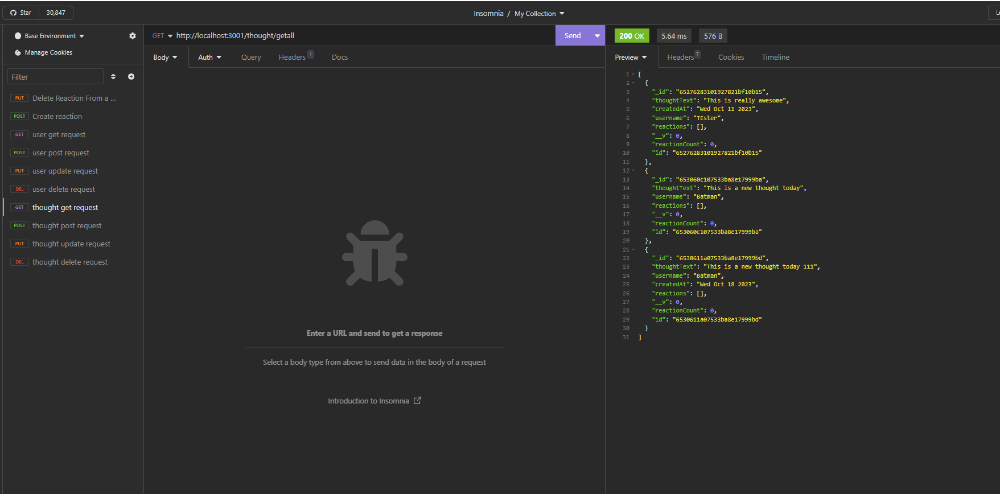

# nosql-sn-api
AS A social media startup I WANT an API for my social network that uses a NoSQL database SO THAT my website can handle large amounts of unstructured data

Screenshot: 

Screencastify Link: https://drive.google.com/file/d/1VMV2_fqBvimf5V2Uad8jaFsUU-ZTmrKU/view

Github Repo: https://github.com/aidev13/nosql-sn-api

## Describing the challenge

Using insomnia with mongoose and mongoDB to demo CRUD

